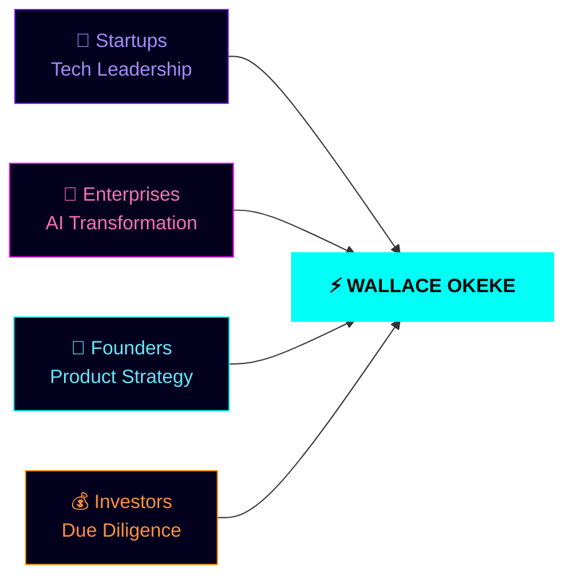

<div align="center">


<br/>

&nbsp;
&nbsp;
&nbsp;
&nbsp;
&nbsp;
&nbsp;
&nbsp;
&nbsp;


<br/><br/>


<br/><br/>

[](https://www.linkedin.com/in/wallace-brown-3908652b0)
[](mailto:brownwallace20@gmail.com)
[](https://github.com/wallaceokeke?tab=repositories)
[](https://github.com/wallaceokeke)

</div>

<br/>


---

##  WHO I AM

<table>
<tr>
<td valign="top" width="58%">

> *I'm Wallace — an AI Systems Architect and Full-Stack Engineer from Nairobi, Kenya.*
>
> *I don't just write code. I build systems that generate revenue, automate complexity, and compound over time. From LLM pipelines to voice AI to fintech automation — every project I touch gets shipped and scaled.*
>
> *My edge: I speak Python and business strategy with equal fluency.*

<br/>

```yaml
name:       Wallace Okeke
role:       AI Systems Architect
location:   Nairobi, Kenya → World
mode:       Digital Nomad 🌍
mission:    Build Africa's tech future
superpower: Where business meets AI
status:     Open to collaboration ✅
```

</td>
<td valign="top" width="42%" align="center">


</td>
</tr>
</table>


---

##  LIVE MISSIONS

<div align="center">
<table>
<tr>

<td align="center" valign="top" width="25%">


**`🟢 LIVE`**

### AI Compliance Bots
*Regulatory automation*
*for real industries*


<br/>


</td>

<td align="center" valign="top" width="25%">


**`🔵 BUILDING`**

### Voice AI Platform
*Real-time speech engine*
*powered by ElevenLabs*


<br/>


</td>

<td align="center" valign="top" width="25%">


**`🟠 SCALING`**

### Fintech Automation
*Revenue systems built*
*for serious scale*


<br/>


</td>

<td align="center" valign="top" width="25%">


**`🟣 RESEARCH`**

### Security AI
*Next-gen threat*
*detection systems*


<br/>


</td>

</tr>
</table>
</div>


---

##  TECHNOLOGY MATRIX

<div align="center">

| AI / ML | Frontend | Backend | Cloud & DevOps |
|:---:|:---:|:---:|:---:|
|  |  |  |  |
|  |  |  |  |
|  |  |  |  |
|  |  |  |  |

</div>


---

##  SYSTEM ARCHITECTURE


<br/>

| Q1 2024 | Q2 2024 | Q3 2024 | Q4 2024 |
|:---:|:---:|:---:|:---:|
| 🟢 **AI Compliance Bots** | 🔵 **Voice AI Platform** | 🟠 **Fintech Automation** | 🟣 **New AI Ventures** |
| Shipped to production | Real-time pipeline | Scaled 10× throughput | Emerging tech research |
| Regulatory systems live | ElevenLabs speech engine | Revenue systems growing | Pipeline wide open |

<br/>




---

##  GITHUB TELEMETRY

<div align="center">


&nbsp;


<br/><br/>


<br/><br/>


<br/><br/>


<br/><br/>

<picture>
  <source media="(prefers-color-scheme: dark)" srcset="https://raw.githubusercontent.com/platane/snk/output/github-contribution-grid-snake-dark.svg" />
  <source media="(prefers-color-scheme: light)" srcset="https://raw.githubusercontent.com/platane/snk/output/github-contribution-grid-snake.svg" />
  
</picture>

</div>


---

##  WHAT I SHIP

<div align="center">
<table>
<tr>

<td align="center" width="33%">


### ⚡ Technical Excellence
```
✦ Full-stack architecture
✦ AI system implementation
✦ Scalable cloud solutions
✦ Production-grade code
```

</td>

<td align="center" width="33%">


### 📈 Business Impact
```
✦ Revenue-generating systems
✦ Market-fit validation
✦ Investor-ready products
✦ 0 → scale frameworks
```

</td>

<td align="center" width="33%">


### 🎯 Strategic Value
```
✦ Technical leadership
✦ Product strategy
✦ Growth acceleration
✦ Africa-first vision
```

</td>
</tr>
</table>
</div>


---

##  OPEN CHANNELS

<div align="center">


<br/><br/>

<a href="https://www.linkedin.com/in/wallace-brown-3908652b0">

</a>

<br/><br/>

<a href="mailto:brownwallace20@gmail.com">

</a>

<br/><br/>

<a href="https://github.com/wallaceokeke?tab=repositories">

</a>

</div>

<br/>


---

<div align="center">

<br/>


&nbsp;

&nbsp;


<br/><br/>


<br/>


&nbsp;
<sub><b>© 2024 Wallace Okeke · AI Systems Architect · Nairobi, Kenya · Building the Future Today</b></sub>
&nbsp;


<br/><br/>


</div>
