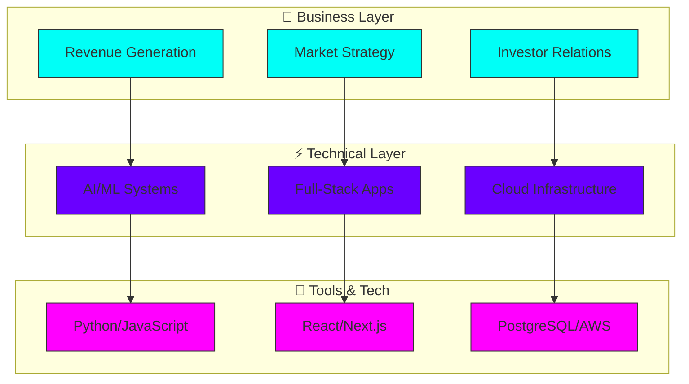
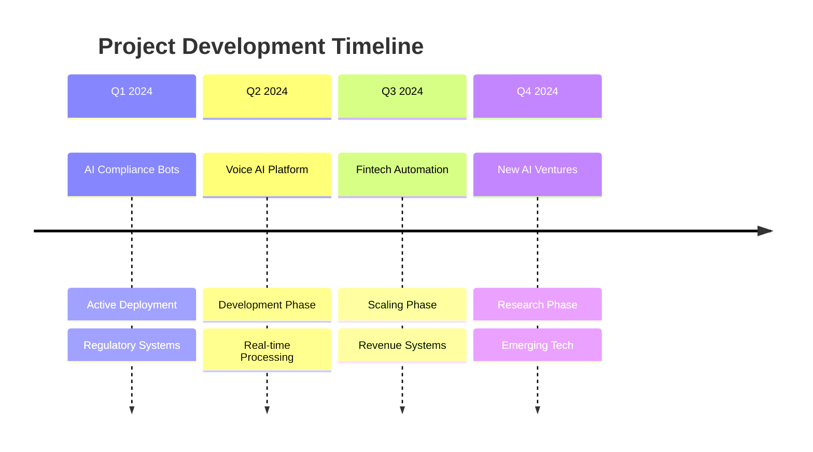
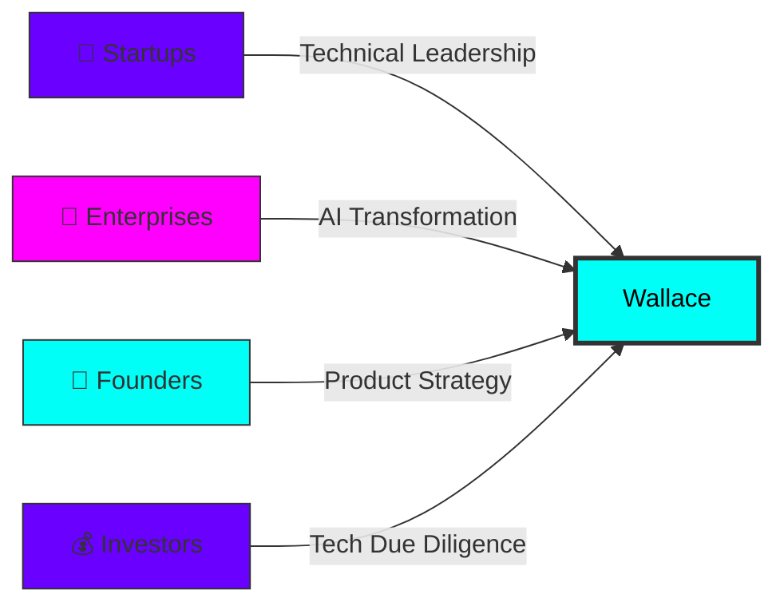

# 🚀 Wallace Okeke – AI Systems Architect & Digital Builder

<p align="center">
  
</p>

<div align="center">
  
</div>

---

## 📊 Real-Time Impact Dashboard

```mermaid
graph LR
    A[🤖 AI Development] --> B[📈 Business Impact]
    C[🌐 Full-Stack] --> B
    D[💼 Strategy] --> B
    B --> E{🚀 Value Creation}
    
    style A fill:#00fff7,stroke:#333,stroke-width:2px
    style C fill:#6a00ff,stroke:#333,stroke-width:2px
    style D fill:#ff00ff,stroke:#333,stroke-width:2px
    style B fill:#0d0d0d,stroke:#00fff7,stroke-width:3px
```

<div align="center">



| Metric                   | Current Status    | Trend |
| ------------------------ | ----------------- | ----- |
| **Active Projects**      | `4`               | 📈 ↗️ |
| **Technical Breadth**    | `Full-Stack + AI` | ⚡     |
| **Business Integration** | `Revenue-Focused` | 💼    |
| **Location Flexibility** | `Digital Nomad`   | 🌍    |

</div>

---

## 🎯 Strategic Focus Areas

<div align="center" style="margin: 20px 0;">
  <table>
    <tr>
      <td align="center" width="33%">
        <div style="background: linear-gradient(135deg, #00fff7, #0d0d0d); padding: 20px; border-radius: 15px; border: 2px solid #00fff7;">
          <h3>🤖 AI Systems</h3>
          <p>Compliance • Voice AI • Automation</p>
          
        </div>
      </td>
      <td align="center" width="33%">
        <div style="background: linear-gradient(135deg, #6a00ff, #0d0d0d); padding: 20px; border-radius: 15px; border: 2px solid #6a00ff;">
          <h3>💻 Full-Stack</h3>
          <p>React • Next.js • Flask • FastAPI</p>
          
        </div>
      </td>
      <td align="center" width="33%">
        <div style="background: linear-gradient(135deg, #ff00ff, #0d0d0d); padding: 20px; border-radius: 15px; border: 2px solid #ff00ff;">
          <h3>🚀 Business</h3>
          <p>Strategy • Scaling • Impact</p>
          
        </div>
      </td>
    </tr>
  </table>
</div>

---

## 📈 Technical Architecture Graph



---

## 🛠️ Technology Radar

<div align="center">

| **AI/ML**     | **Frontend**  | **Backend**    | **Infrastructure** |
| ------------- | ------------- | -------------- | ------------------ |
| Python 🐍     | React ⚛️      | Flask 🚀       | AWS ☁️             |
| PyTorch 🤖    | Next.js 📱    | FastAPI ⚡      | Docker 🐳          |
| OpenAI ⚡      | TypeScript 📘 | PostgreSQL 🗄️ | GitHub Actions 🔄  |
| ElevenLabs 🎤 | Tailwind 🎨   | Redis 🔥       | Linux 🐧           |


</div>

---

## 🚀 Innovation Pipeline Timeline



---

## 📊 GitHub Analytics Suite

<div align="center" style="display: flex; justify-content: center; gap: 20px; flex-wrap: wrap; margin: 30px 0;">

<div style="background: linear-gradient(135deg, #0d1117, #00fff722); padding: 15px; border-radius: 15px; border: 2px solid #00fff7; width: 280px;">
  
  <p align="center"><b>Performance Metrics</b></p>
</div>

<div style="background: linear-gradient(135deg, #0d1117, #6a00ff22); padding: 15px; border-radius: 15px; border: 2px solid #6a00ff; width: 280px;">
  
  <p align="center"><b>Language Distribution</b></p>
</div>

<div style="background: linear-gradient(135deg, #0d1117, #ff00ff22); padding: 15px; border-radius: 15px; border: 2px solid #ff00ff; width: 280px;">
  
  <p align="center"><b>Consistency Streak</b></p>
</div>

</div>

---

## 🌟 Project Portfolio Matrix

| Project                   | Stage       | Business Impact | Tech Complexity |
| ------------------------- | ----------- | --------------- | --------------- |
| **🤖 AI Compliance Bots** | 🚀 Active   | High            | Advanced        |
| **🎤 Voice AI Platform**  | 🔨 Building | Medium-High     | Expert          |
| **💸 Fintech Automation** | 📈 Scaling  | Very High       | Advanced        |
| **🔐 Security AI**        | 🔬 Research | Medium          | Expert          |

---

## 🎨 Value Proposition Canvas

<div align="center" style="background: linear-gradient(135deg, #0d0d0d, #1a1a2e); padding: 25px; border-radius: 20px; border: 3px solid #00fff7; margin: 30px 0;">

### **What I Deliver** 🚀

```yaml
technical_excellence:
  - Full-stack architecture
  - AI system implementation
  - Scalable cloud solutions

business_impact:
  - Revenue-generating systems
  - Market-fit validation
  - Investor-ready products

strategic_value:
  - Technical leadership
  - Product strategy
  - Growth acceleration
```

</div>

---

## 🤝 Collaboration Network



---

## 📞 Strategic Connect Points

<div align="center" style="display: grid; grid-template-columns: repeat(auto-fit, minmax(250px, 1fr)); gap: 20px; margin: 40px 0;">

<div style="background: linear-gradient(135deg, #00fff7, #0d0d0d); padding: 20px; border-radius: 15px; text-align: center;">
  <h3>💼 LinkedIn</h3>
  <p>Professional Network</p>
  <a href="https://www.linkedin.com/in/wallace-brown-3908652b0" target="_blank">
    
  </a>
</div>

<div style="background: linear-gradient(135deg, #6a00ff, #0d0d0d); padding: 20px; border-radius: 15px; text-align: center;">
  <h3>📧 Email</h3>
  <p>Direct Collaboration</p>
  <a href="mailto:brownwallace20@gmail.com" target="_blank">
    
  </a>
</div>

<div style="background: linear-gradient(135deg, #ff00ff, #0d0d0d); padding: 20px; border-radius: 15px; text-align: center;">
  <h3>💻 GitHub</h3>
  <p>Project Portfolio</p>
  <a href="https://github.com/wallaceokeke" target="_blank">
    
  </a>
</div>

</div>

---

## 🚀 Ready to Build the Future?

```yaml
collaboration_criteria:
  looking_for:
    - "Ambitious technical challenges"
    - "Revenue-impact projects"
    - "Innovation-focused teams"
    - "Scalable system architecture"
    
offer:
    - "End-to-end technical leadership"
    - "AI-powered solutions"
    - "Business-tech integration"
    - "Digital transformation expertise"
```

---

## 🎯 Final Call to Action

<div align="center" style="background: linear-gradient(135deg, #00fff7, #6a00ff, #ff00ff); padding: 40px; border-radius: 25px; margin: 50px 0;">

<h2 style="color: #0d0d0d;">⚡ Let's Create Something Extraordinary</h2>

<p style="color: #0d0d0d; font-size: 1.2em; margin: 20px 0;">
  <i>"From concept to scalable reality — let's build Africa's tech future together."</i>
</p>

<div style="display: flex; justify-content: center; gap: 20px; margin-top: 30px; flex-wrap: wrap;">
  <a href="mailto:brownwallace20@gmail.com" style="text-decoration: none;">
    <button style="background: #0d0d0d; color: #00fff7; border: 3px solid #00fff7; padding: 15px 30px; border-radius: 10px; font-size: 1.1em; cursor: pointer; font-weight: bold;">
      📧 Start Conversation
    </button>
  </a>

  <a href="https://github.com/wallaceokeke?tab=repositories" style="text-decoration: none;">
    <button style="background: #0d0d0d; color: #ff00ff; border: 3px solid #ff00ff; padding: 15px 30px; border-radius: 10px; font-size: 1.1em; cursor: pointer; font-weight: bold;">
      💻 Explore Projects
    </button>
  </a>
</div>

</div>

<p align="center">
  
</p>

<p align="center" style="margin-top: 20px;">
  <sub>© 2024 Wallace Okeke • AI Systems Architect • Building the Future Today</sub>
</p>

---
