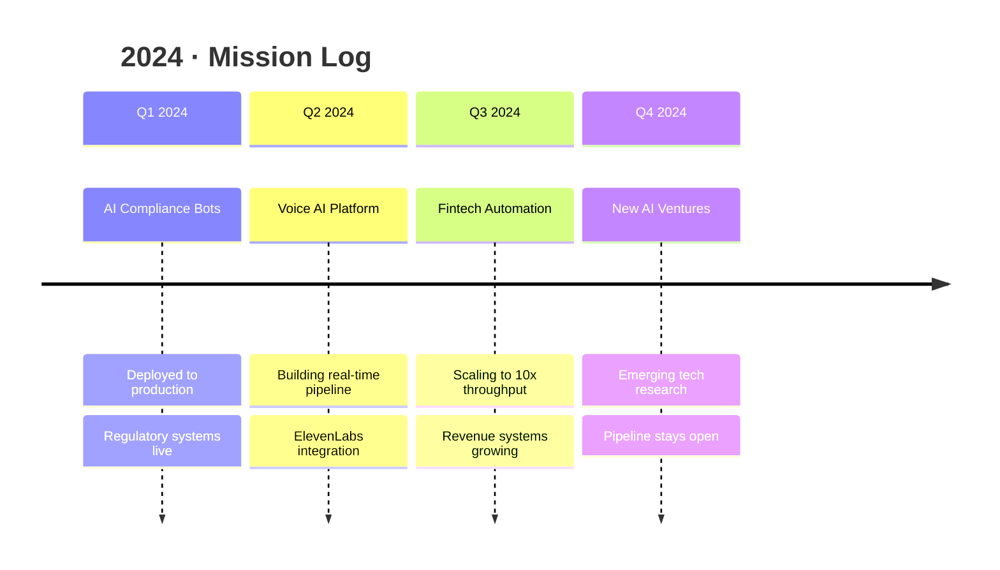
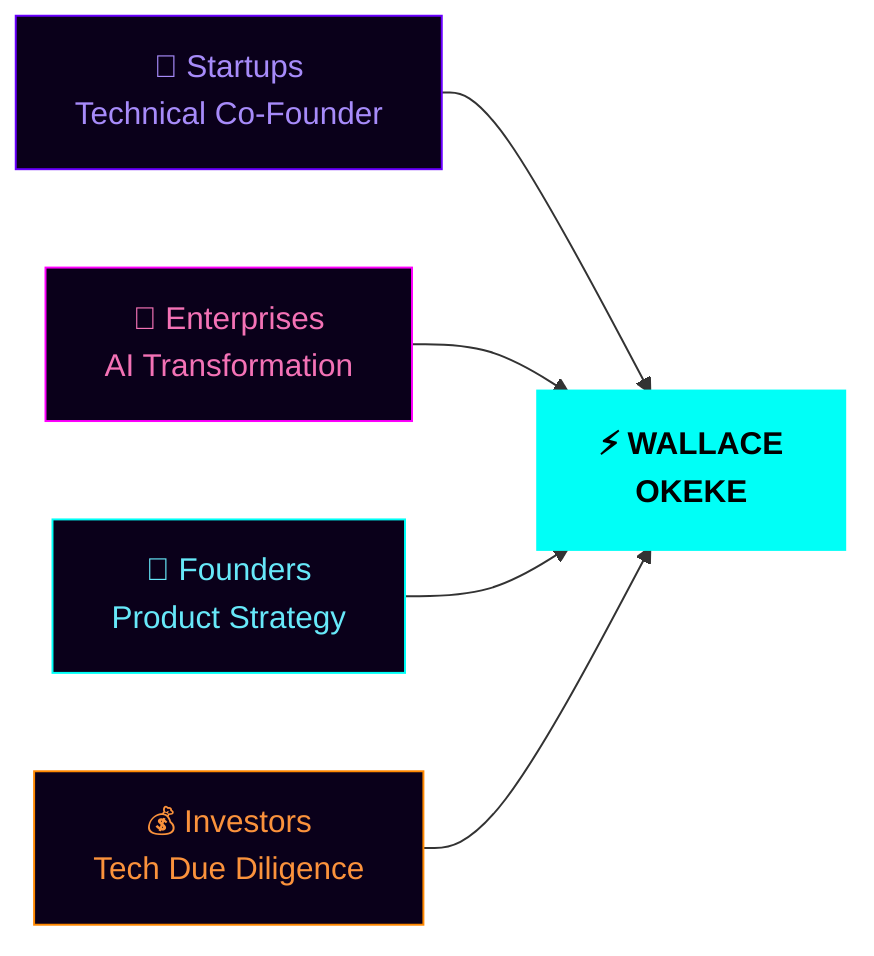

<div align="center">

<!-- CINEMATIC HEADER -->


</div>


<br/>

<!-- ANIMATED ICONS ROW -->
<div align="center">
&nbsp;&nbsp;
&nbsp;&nbsp;
&nbsp;&nbsp;
&nbsp;&nbsp;
&nbsp;&nbsp;
&nbsp;&nbsp;
&nbsp;&nbsp;

</div>

<br/>

<div align="center">

<!-- MAIN TYPING ANIMATION -->


<br/><br/>

<!-- CONNECT LINKS -->
[](https://www.linkedin.com/in/wallace-brown-3908652b0)
[](mailto:brownwallace20@gmail.com)
[](https://github.com/wallaceokeke?tab=repositories)
[](https://github.com/wallaceokeke)

</div>

<br/>


---

##  THE STORY SO FAR

<br/>

<div align="left">

> *I'm Wallace — an AI Systems Architect and Full-Stack Engineer operating out of Nairobi, Kenya.*
> *I don't just write code. I architect systems that generate revenue, automate complexity, and scale.*
> *From compliance bots to voice AI to fintech automation — every project I touch gets shipped.*
> *My edge: I speak both Python and business fluently.*

</div>

<br/>

<div align="center">

<table>
<tr>
<td>

```yaml
name:       Wallace Okeke
title:      AI Systems Architect
location:   Nairobi, Kenya  →  World
mode:       Digital Nomad
mission:    Build Africa's tech future
superpower: Business logic meets AI
available:  Yes — let's talk
```

</td>
<td>

```python
class WallaceOkeke:
    def __init__(self):
        self.role    = "AI Systems Architect"
        self.stack   = ["Python","React","FastAPI","LLMs"]
        self.city    = "Nairobi, KE"
        self.focus   = "0 → production → scale"
        self.mode    = "Digital Nomad 🌍"

    def ship(self, idea):
        return idea.build().test().deploy()
        # always returns: IMPACT
```

</td>
</tr>
</table>

</div>


---

##  WHAT I'M BUILDING

<br/>

<div align="center">
<table>
<tr>

<td align="center" valign="top" width="25%">


### 🟢 LIVE
**AI Compliance Bots**

*Regulatory automation*
*for real industries*


</td>

<td align="center" valign="top" width="25%">


### 🔵 BUILDING
**Voice AI Platform**

*Real-time speech*
*powered by ElevenLabs*


</td>

<td align="center" valign="top" width="25%">


### 🟠 SCALING
**Fintech Automation**

*Revenue systems*
*at serious scale*


</td>

<td align="center" valign="top" width="25%">


### 🟣 RESEARCH
**Security AI**

*Next-gen threat*
*detection systems*


</td>

</tr>
</table>
</div>


---

##  THE STACK

<br/>

<div align="center">

<!-- DEVELOPER GIF -->


**AI & Machine Learning**


<br/>

**Frontend & UI**


<br/>

**Backend & Data**


<br/>

**Cloud & DevOps**


</div>

<br/><br/>


---

##  ARCHITECTURE

<br/>


<br/>




---

##  GITHUB STATS

<br/>

<div align="center">


&nbsp;


<br/><br/>


<br/><br/>


<br/><br/>


<br/><br/>

<!-- SNAKE CONTRIBUTION ANIMATION -->
<picture>
  <source media="(prefers-color-scheme: dark)" srcset="https://raw.githubusercontent.com/platane/snk/output/github-contribution-grid-snake-dark.svg" />
  <source media="(prefers-color-scheme: light)" srcset="https://raw.githubusercontent.com/platane/snk/output/github-contribution-grid-snake.svg" />
  
</picture>

</div>


---

##  WHO I BUILD WITH

<br/>




---

##  CONNECT

<br/>

<div align="center">


<br/><br/>

<a href="https://www.linkedin.com/in/wallace-brown-3908652b0">
  
</a>

<br/><br/>

<a href="mailto:brownwallace20@gmail.com">
  
</a>

<br/><br/>

<a href="https://github.com/wallaceokeke?tab=repositories">
  
</a>

</div>

<br/>


---

<div align="center">

<br/>


<br/><br/>


&nbsp;
<sub><b>© 2024 Wallace Okeke · AI Systems Architect · Nairobi, Kenya</b></sub>
&nbsp;


<br/><br/>


</div>
