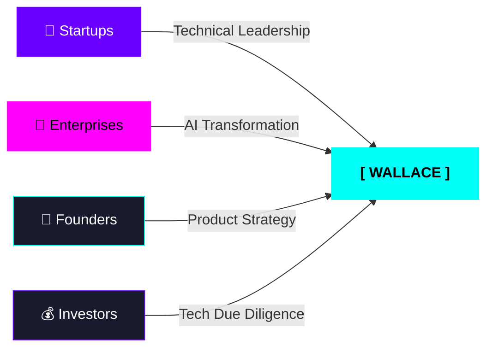

<div align="center">


<br/>


<br/>

[](https://www.linkedin.com/in/wallace-brown-3908652b0)
[](mailto:brownwallace20@gmail.com)
[](https://github.com/wallaceokeke?tab=repositories)
[](https://github.com/wallaceokeke)

</div>

---

```
╔══════════════════════════════════════════════════════════════════════════╗
║                        SYSTEM IDENTIFICATION                            ║
╠══════════════════════════════════════════════════════════════════════════╣
║  USER    →  Wallace Okeke                                               ║
║  ROLE    →  AI Systems Architect / Full-Stack Engineer / Entrepreneur   ║
║  OS      →  Ubuntu 24.04 LTS  |  Node: v20  |  Python: 3.11            ║
║  BASE    →  Nairobi, Kenya  //  MODE: Digital Nomad                     ║
║  STACK   →  Python · React · Next.js · FastAPI · Flask · PostgreSQL     ║
║  FOCUS   →  AI Automation · Voice AI · Fintech · Compliance Systems     ║
║  STATUS  →  [ ██████████ ] 100% — ONLINE & BUILDING                    ║
╚══════════════════════════════════════════════════════════════════════════╝
```

---

## `> ls -la /projects`

<div align="center">

| `drwxr` | Project | Branch | Impact | Complexity |
|:---:|:---|:---:|:---:|:---:|
| 🟢 | **AI Compliance Bots** — *Regulatory automation systems* | `main` `active` | `HIGH` | `ADVANCED` |
| 🔵 | **Voice AI Platform** — *Real-time speech · ElevenLabs* | `dev` `building` | `MEDIUM-HIGH` | `EXPERT` |
| 🟠 | **Fintech Automation** — *Revenue systems at scale* | `scale` `growing` | `VERY HIGH` | `ADVANCED` |
| 🟣 | **Security AI** — *Emerging threat detection* | `research` `alpha` | `MEDIUM` | `EXPERT` |

</div>

---

## `> cat /focus/ai_systems.md`

<div align="center">
<table>
<tr>

<td align="center" width="33%">

```
┌─────────────────────────┐
│    [ AI SYSTEMS ]       │
│  ░░░░░░░░░░░░░░░░░░░░░  │
│  ▓  Compliance Bots  ▓  │
│  ▓  Voice AI         ▓  │
│  ▓  LLM Pipelines    ▓  │
│  ▓  RAG Systems      ▓  │
└─────────────────────────┘
```


</td>

<td align="center" width="33%">

```
┌─────────────────────────┐
│   [ FULL-STACK ]        │
│  ░░░░░░░░░░░░░░░░░░░░░  │
│  ▓  React / Next.js  ▓  │
│  ▓  FastAPI / Flask  ▓  │
│  ▓  PostgreSQL       ▓  │
│  ▓  TypeScript       ▓  │
└─────────────────────────┘
```


</td>

<td align="center" width="33%">

```
┌─────────────────────────┐
│   [ BUSINESS ]          │
│  ░░░░░░░░░░░░░░░░░░░░░  │
│  ▓  GTM Strategy     ▓  │
│  ▓  0 → Scale        ▓  │
│  ▓  Investor Ready   ▓  │
│  ▓  Revenue Focus    ▓  │
└─────────────────────────┘
```


</td>

</tr>
</table>
</div>

---

## `> cat /stack/radar.config`

<div align="center">


<br/><br/>

|  |  |  |  |
|:---:|:---:|:---:|:---:|
|  |  |  |  |
|  |  |  |  |
|  |  |  |  |

</div>

---

## `> git log --oneline /timeline/2024`

```
a1f3c9e  Q1 2024  🟢  feat: deploy AI compliance bots → production
         │              → regulatory automation systems live
         │
b7d2e1a  Q2 2024  🔵  feat: build voice AI platform
         │              → real-time ElevenLabs speech processing
         │
c4a8f0b  Q3 2024  🟠  feat: scale fintech automation engine
         │              → revenue systems expanding
         │
d9e5c3f  Q4 2024  🟣  research: new AI ventures
                       → emerging tech pipeline open
```

---

## `> run analytics --user wallaceokeke`

<div align="center">


&nbsp;


<br/><br/>


<br/><br/>


</div>

---

## `> cat /architecture/system_design.mmd`


---

## `> cat /network/collaboration.graph`



---

## `> cat /value/proposition.yaml`

```yaml
# ╔══════════════════════════════════════════════════════╗
# ║          WALLACE OKEKE — WHAT I DEPLOY               ║
# ╚══════════════════════════════════════════════════════╝

module: technical_excellence
  status: ACTIVE
  delivers:
    - full_stack_architecture
    - ai_system_implementation
    - scalable_cloud_solutions

module: business_impact
  status: ACTIVE
  delivers:
    - revenue_generating_systems
    - market_fit_validation
    - investor_ready_products

module: strategic_value
  status: ACTIVE
  delivers:
    - technical_leadership
    - product_strategy
    - growth_0_to_scale
```

---

## `> ssh connect@wallace.okeke --port all`

<div align="center">

<table>
<tr>
<td align="center" width="33%">

```
> ping linkedin
HOST: linkedin.com/in/wallace
STATUS: ● ONLINE
LATENCY: instant
```

[](https://www.linkedin.com/in/wallace-brown-3908652b0)

</td>
<td align="center" width="33%">

```
> ping email
HOST: brownwallace20@gmail
STATUS: ● ONLINE
LATENCY: < 24h
```

[](mailto:brownwallace20@gmail.com)

</td>
<td align="center" width="33%">

```
> ping github
HOST: github/wallaceokeke
STATUS: ● ONLINE
LATENCY: async
```

[](https://github.com/wallaceokeke?tab=repositories)

</td>
</tr>
</table>

</div>

---

<div align="center">


<br/><br/>


<br/>


</div>
