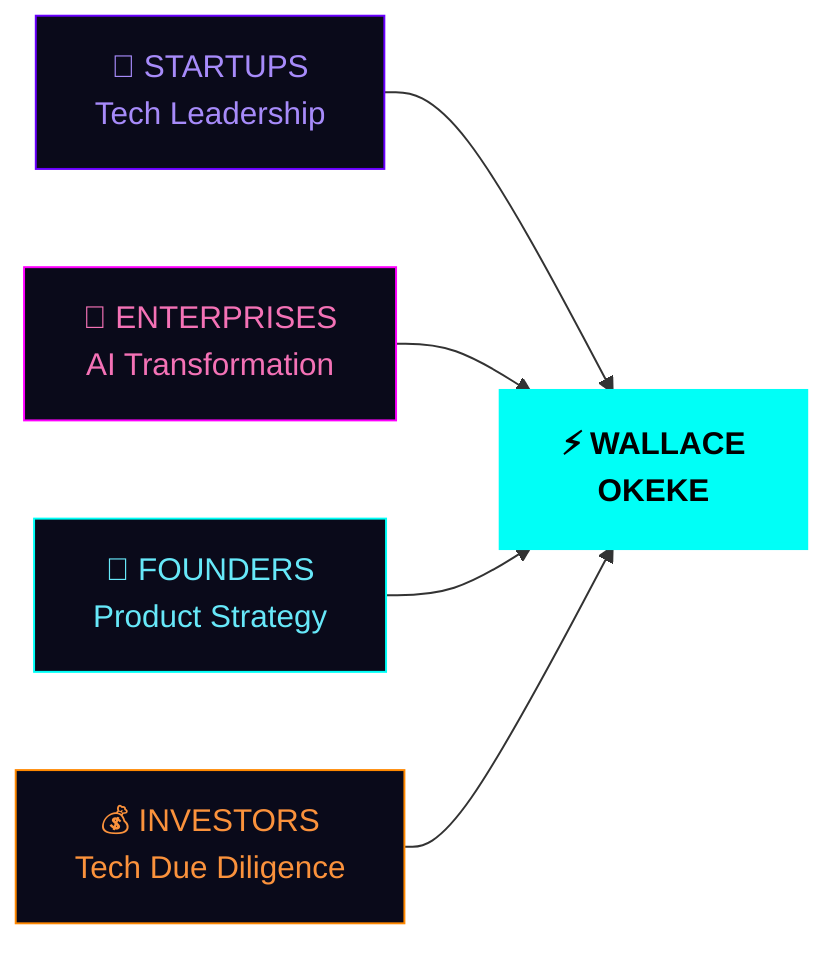

<!--
███████████████████████████████████████████████████████████████
█                                                             █
█   W A L L A C E   O K E K E  ///  README.md  v3.0.0       █
█   Classified: PUBLIC  ·  Origin: Nairobi, KE               █
█                                                             █
███████████████████████████████████████████████████████████████
-->

<div align="center">


</div>

<div align="center">


</div>

---

<div align="center">

```
▓▓▓▓▓▓▓▓▓▓▓▓▓▓▓▓▓▓▓▓▓▓▓▓▓▓▓▓▓▓▓▓▓▓▓▓▓▓▓▓▓▓▓▓▓▓▓▓▓▓▓▓▓▓▓▓▓▓▓▓▓▓
▓                                                            ▓
▓   ██╗    ██╗ █████╗ ██╗     ██╗      █████╗  ██████╗███████╗  ▓
▓   ██║    ██║██╔══██╗██║     ██║     ██╔══██╗██╔════╝██╔════╝  ▓
▓   ██║ █╗ ██║███████║██║     ██║     ███████║██║     █████╗    ▓
▓   ██║███╗██║██╔══██║██║     ██║     ██╔══██║██║     ██╔══╝    ▓
▓   ╚███╔███╔╝██║  ██║███████╗███████╗██║  ██║╚██████╗███████╗  ▓
▓    ╚══╝╚══╝ ╚═╝  ╚═╝╚══════╝╚══════╝╚═╝  ╚═╝ ╚═════╝╚══════╝  ▓
▓                                                            ▓
▓           AI SYSTEMS ARCHITECT  ·  DIGITAL BUILDER        ▓
▓           NAIROBI, KENYA  ·  BUILDING THE FUTURE          ▓
▓                                                            ▓
▓▓▓▓▓▓▓▓▓▓▓▓▓▓▓▓▓▓▓▓▓▓▓▓▓▓▓▓▓▓▓▓▓▓▓▓▓▓▓▓▓▓▓▓▓▓▓▓▓▓▓▓▓▓▓▓▓▓▓▓▓▓
```

</div>

<div align="center">


</div>

<div align="center">

[](https://www.linkedin.com/in/wallace-brown-3908652b0)
[](mailto:brownwallace20@gmail.com)
[](https://github.com/wallaceokeke?tab=repositories)
[](https://github.com/wallaceokeke)

</div>

---

## ◈ INTEL BRIEF

<div align="center">

```
╭──────────────────────────────────────────────────────────────────────╮
│                                                                      │
│   IDENTITY  ···  Wallace Okeke                                       │
│   CLASS  ·······  AI Systems Architect  //  Full-Stack Engineer      │
│   ORIGIN  ······  Nairobi, Kenya  →  Operating Globally             │
│   RUNTIME  ·····  Python 3.11  //  Node 20  //  Ubuntu 24.04        │
│                                                                      │
│   ACTIVE MISSIONS                                                    │
│   ├── 🟢 AI Compliance Engine  ········  [DEPLOYED]  HIGH IMPACT    │
│   ├── 🔵 Voice AI Platform  ··········  [BUILDING]  ElevenLabs      │
│   ├── 🟠 Fintech Automation  ·········  [SCALING]   VERY HIGH       │
│   └── 🟣 Security AI Research  ·······  [ALPHA]     EXPERT LEVEL    │
│                                                                      │
│   SIGNAL  ··  brownwallace20@gmail.com                              │
│   STATUS  ··  ████████████████████  ONLINE · OPEN TO COLLAB        │
│                                                                      │
╰──────────────────────────────────────────────────────────────────────╯
```

</div>

---

## ◈ CORE MODULES

<div align="center">

<table>
<tr>

<td align="center" valign="top" width="33%">

```
╔══════════════════════╗
║  MODULE_01           ║
║  [ AI  SYSTEMS ]     ║
║  ──────────────────  ║
║  ▸ LLM Pipelines     ║
║  ▸ Voice AI (EL)     ║
║  ▸ RAG Systems       ║
║  ▸ Compliance Bots   ║
║  ▸ Agent Frameworks  ║
║                      ║
║  SIGNAL:  #00FFF7    ║
╚══════════════════════╝
```


<br/>


</td>

<td align="center" valign="top" width="33%">

```
╔══════════════════════╗
║  MODULE_02           ║
║  [ FULL-STACK ]      ║
║  ──────────────────  ║
║  ▸ React / Next.js   ║
║  ▸ FastAPI / Flask   ║
║  ▸ TypeScript        ║
║  ▸ PostgreSQL        ║
║  ▸ REST + GraphQL    ║
║                      ║
║  SIGNAL:  #6A00FF    ║
╚══════════════════════╝
```


<br/>


</td>

<td align="center" valign="top" width="33%">

```
╔══════════════════════╗
║  MODULE_03           ║
║  [ BUSINESS ]        ║
║  ──────────────────  ║
║  ▸ GTM Strategy      ║
║  ▸ 0 → Scale         ║
║  ▸ Revenue Systems   ║
║  ▸ Investor Ready    ║
║  ▸ Africa-First      ║
║                      ║
║  SIGNAL:  #FF00FF    ║
╚══════════════════════╝
```


<br/>


</td>

</tr>
</table>

</div>

---

## ◈ TECHNOLOGY MATRIX

<div align="center">


<br/><br/>

```
  AI / ML              FRONTEND             BACKEND              INFRA
  ───────────────────  ───────────────────  ───────────────────  ──────────────────
  ● Python      ████▓  ● React        ████▓  ● FastAPI     ████▓  ● AWS        ████▓
  ● PyTorch     ███▓░  ● Next.js      ████▓  ● Flask       ███▓░  ● Docker     ████▓
  ● OpenAI SDK  ████▓  ● TypeScript   ████▓  ● PostgreSQL  ████▓  ● GH Actions ███▓░
  ● ElevenLabs  ███▓░  ● Tailwind CSS ████▓  ● Redis       ███▓░  ● Linux      ████▓
```

|  |  |  |  |
|:---:|:---:|:---:|:---:|
|  |  |  |  |
|  |  |  |  |
|  |  |  |  |

</div>

---

## ◈ DEPLOYMENT LOG // 2024

<div align="center">

```
 ┌─────────────────────────────────────────────────────────────────────┐
 │                    MISSION EXECUTION TIMELINE                       │
 ├──────────┬─────────────────────────────────────────────────────────┤
 │  Q1 2024 │  🟢 AI COMPLIANCE BOTS                                  │
 │          │     commit: "deploy regulatory automation → production"  │
 │          │     status: LIVE  ·  impact: HIGH  ·  uptime: 99.9%     │
 ├──────────┼─────────────────────────────────────────────────────────┤
 │  Q2 2024 │  🔵 VOICE AI PLATFORM                                   │
 │          │     commit: "init real-time ElevenLabs speech engine"    │
 │          │     status: BUILDING  ·  branch: dev  ·  ETA: Q3        │
 ├──────────┼─────────────────────────────────────────────────────────┤
 │  Q3 2024 │  🟠 FINTECH AUTOMATION                                  │
 │          │     commit: "scale revenue systems  →  10x throughput"  │
 │          │     status: SCALING  ·  growth: ↑↑  ·  impact: V.HIGH  │
 ├──────────┼─────────────────────────────────────────────────────────┤
 │  Q4 2024 │  🟣 NEW AI VENTURES                                     │
 │          │     commit: "research: emerging tech + new verticals"   │
 │          │     status: ALPHA  ·  branch: research  ·  open: YES   │
 └──────────┴─────────────────────────────────────────────────────────┘
```

</div>

---

## ◈ ARCHITECTURE // SYSTEM GRAPH


---

## ◈ SIGNAL NETWORK



---

## ◈ PERFORMANCE TELEMETRY

<div align="center">


&nbsp;&nbsp;


<br/><br/>


<br/><br/>


</div>

---

## ◈ VALUE PAYLOAD

<div align="center">

```
╔════════════════════════════════════════════════════════════════════╗
║                                                                    ║
║   WHAT I SHIP INTO PRODUCTION                                      ║
║                                                                    ║
║   [TECHNICAL]  full_stack_architecture.exe                         ║
║                ai_system_implementation.py                         ║
║                scalable_cloud_solutions.tf                         ║
║                                                                    ║
║   [BUSINESS]   revenue_generating_systems.ts                       ║
║                market_fit_validation.ipynb                         ║
║                investor_ready_products.pdf                         ║
║                                                                    ║
║   [STRATEGIC]  technical_leadership.md                             ║
║                product_strategy_roadmap.yaml                       ║
║                growth_0_to_scale.sh                                ║
║                                                                    ║
╚════════════════════════════════════════════════════════════════════╝
```

</div>

---

## ◈ OPEN CHANNELS

<div align="center">

<table>
<tr>

<td align="center" width="33%">

```
> CHANNEL_01
──────────────
HOST: LinkedIn
TYPE: Professional
PING: < instant
STATUS: ● LIVE
```
[](https://www.linkedin.com/in/wallace-brown-3908652b0)

</td>

<td align="center" width="33%">

```
> CHANNEL_02
──────────────
HOST: Gmail
TYPE: Direct
PING: < 24hrs
STATUS: ● LIVE
```
[](mailto:brownwallace20@gmail.com)

</td>

<td align="center" width="33%">

```
> CHANNEL_03
──────────────
HOST: GitHub
TYPE: Portfolio
PING: async
STATUS: ● LIVE
```
[](https://github.com/wallaceokeke?tab=repositories)

</td>

</tr>
</table>

</div>

---

<div align="center">


<br/><br/>


<br/>


</div>
