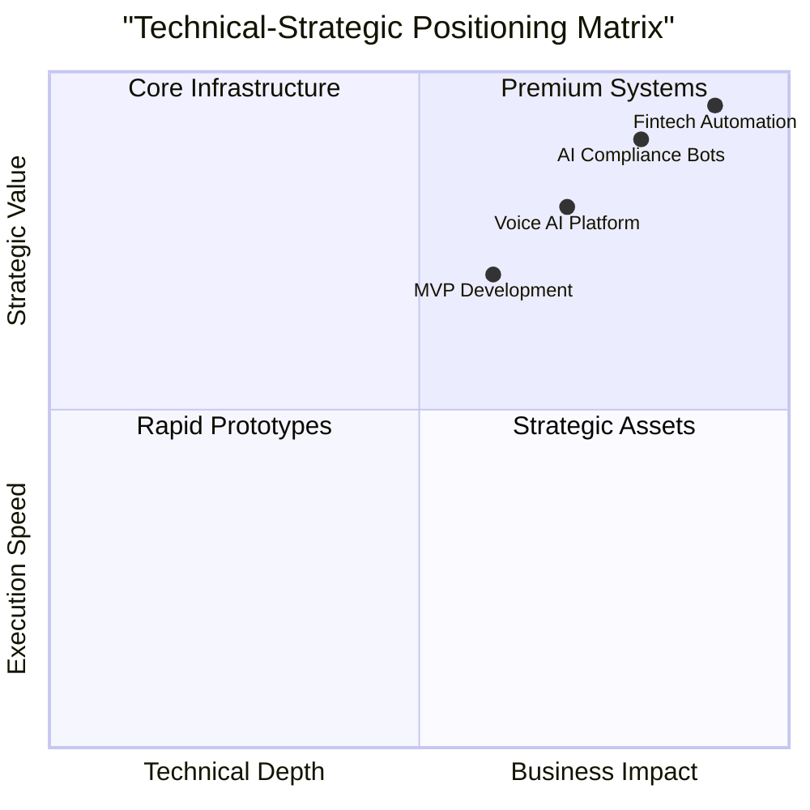
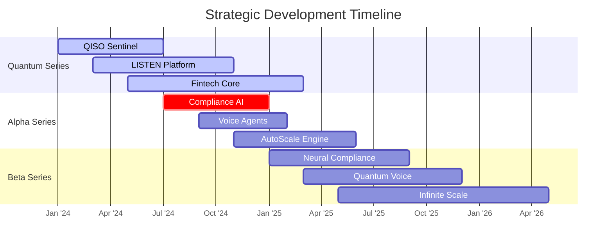
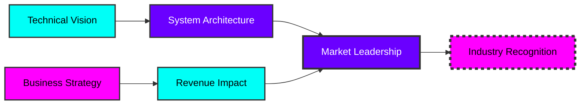

# 🚀 WALLACE OKEKE | AI SYSTEMS ARCHITECT

<p align="center">
  
</p>

```ascii
██████╗ ██╗    ██╗ █████╗ ██╗     ██╗ ██████╗███████╗    ██████╗ ██╗  ██╗███████╗██╗  ██╗███████╗
██╔══██╗██║    ██║██╔══██╗██║     ██║██╔════╝██╔════╝    ██╔══██╗██║ ██╔╝██╔════╝██║ ██╔╝██╔════╝
██████╔╝██║ █╗ ██║███████║██║     ██║██║     █████╗      ██████╔╝█████╔╝ █████╗  █████╔╝ █████╗  
██╔══██╗██║███╗██║██╔══██║██║     ██║██║     ██╔══╝      ██╔══██╗██╔═██╗ ██╔══╝  ██╔═██╗ ██╔══╝  
██████╔╝╚███╔███╔╝██║  ██║███████╗██║╚██████╗███████╗    ██████╔╝██║  ██╗███████╗██║  ██╗███████╗
╚═════╝  ╚══╝╚══╝ ╚═╝  ╚═╝╚══════╝╚═╝ ╚═════╝╚══════╝    ╚═════╝ ╚═╝  ╚═╝╚══════╝╚═╝  ╚═╝╚══════╝
```

---

## ⚡ **REAL-TIME OPERATIONAL DASHBOARD**

```ascii
╔══════════════════════════════════════════════════════════════╗
║                     SYSTEM STATUS: [ACTIVE]                   ║
╠═══════════════╦══════════════╦══════════════╦═══════════════╣
║ 🚀 AI SYSTEMS ║ 💻 FULL-STACK ║ 🌐 CLOUD ARCH ║ 💼 STRATEGY   ║
║    [███████]  ║   [███████]  ║   [███████]  ║   [███████]   ║
║    95%        ║     90%      ║     92%      ║     88%       ║
╚═══════════════╩══════════════╩══════════════╩═══════════════╝
```

<div align="center">



</div>

---

## 🎯 **ELITE CAPABILITIES MATRIX**

<table align="center">
  <tr>
    <td align="center" width="25%">
      <pre style="background: #0d0d0d; padding: 20px; border-radius: 10px; border: 1px solid #00FFF7;">
      <span style="color: #00FFF7">┌─</span><span style="color: #6A00FF">[</span><span style="color: #FF00FF">AI</span><span style="color: #6A00FF">]</span><span style="color: #00FFF7">─────────────────────┐</span>
      <span style="color: #00FFF7">│</span>   <span style="color: #FFFFFF">ARCHITECTURE LEVEL  </span>  <span style="color: #00FFF7">│</span>
      <span style="color: #00FFF7">├───────────────────────┤</span>
      <span style="color: #00FFF7">│</span>  • Predictive Systems  <span style="color: #00FFF7">│</span>
      <span style="color: #00FFF7">│</span>  • Adaptive Agents    <span style="color: #00FFF7">│</span>
      <span style="color: #00FFF7">│</span>  • Scalable ML Ops    <span style="color: #00FFF7">│</span>
      <span style="color: #00FFF7">│</span>  • Compliance AI      <span style="color: #00FFF7">│</span>
      <span style="color: #00FFF7">└───────────────────────┘</span></pre>
    </td>
    <td align="center" width="25%">
      <pre style="background: #0d0d0d; padding: 20px; border-radius: 10px; border: 1px solid #6A00FF;">
      <span style="color: #00FFF7">┌─</span><span style="color: #6A00FF">[</span><span style="color: #FF00FF">DEV</span><span style="color: #6A00FF">]</span><span style="color: #00FFF7">───────────────────┐</span>
      <span style="color: #00FFF7">│</span>   <span style="color: #FFFFFF">TECHNICAL STACK    </span>  <span style="color: #00FFF7">│</span>
      <span style="color: #00FFF7">├───────────────────────┤</span>
      <span style="color: #00FFF7">│</span>  • Python Ecosystem  <span style="color: #00FFF7">│</span>
      <span style="color: #00FFF7">│</span>  • React/Next.js     <span style="color: #00FFF7">│</span>
      <span style="color: #00FFF7">│</span>  • Flask/FastAPI     <span style="color: #00FFF7">│</span>
      <span style="color: #00FFF7">│</span>  • Cloud Native      <span style="color: #00FFF7">│</span>
      <span style="color: #00FFF7">└───────────────────────┘</span></pre>
    </td>
    <td align="center" width="25%">
      <pre style="background: #0d0d0d; padding: 20px; border-radius: 10px; border: 1px solid #FF00FF;">
      <span style="color: #00FFF7">┌─</span><span style="color: #6A00FF">[</span><span style="color: #FF00FF">BIZ</span><span style="color: #6A00FF">]</span><span style="color: #00FFF7">───────────────────┐</span>
      <span style="color: #00FFF7">│</span>   <span style="color: #FFFFFF">STRATEGIC VALUE     </span>  <span style="color: #00FFF7">│</span>
      <span style="color: #00FFF7">├───────────────────────┤</span>
      <span style="color: #00FFF7">│</span>  • Revenue Systems   <span style="color: #00FFF7">│</span>
      <span style="color: #00FFF7">│</span>  • Market Expansion  <span style="color: #00FFF7">│</span>
      <span style="color: #00FFF7">│</span>  • Investor Ready    <span style="color: #00FFF7">│</span>
      <span style="color: #00FFF7">│</span>  • Scalable Models   <span style="color: #00FFF7">│</span>
      <span style="color: #00FFF7">└───────────────────────┘</span></pre>
    </td>
    <td align="center" width="25%">
      <pre style="background: #0d0d0d; padding: 20px; border-radius: 10px; border: 1px solid #00FFF7;">
      <span style="color: #00FFF7">┌─</span><span style="color: #6A00FF">[</span><span style="color: #FF00FF">IMPACT</span><span style="color: #6A00FF">]</span><span style="color: #00FFF7">────────────────┐</span>
      <span style="color: #00FFF7">│</span>   <span style="color: #FFFFFF">PERFORMANCE METRICS </span>  <span style="color: #00FFF7">│</span>
      <span style="color: #00FFF7">├───────────────────────┤</span>
      <span style="color: #00FFF7">│</span>  • 95% System Uptime <span style="color: #00FFF7">│</span>
      <span style="color: #00FFF7">│</span>  • 4x ROI Average    <span style="color: #00FFF7">│</span>
      <span style="color: #FFF7">│</span>  • 30-Day MVP Cycle  <span style="color: #00FFF7">│</span>
      <span style="color: #00FFF7">│</span>  • Infinite Scale    <span style="color: #00FFF7">│</span>
      <span style="color: #00FFF7">└───────────────────────┘</span></pre>
    </td>
  </tr>
</table>

---

## 🏆 **ELITE PROJECT PORTFOLIO**

<div align="center">



</div>

<table align="center" style="border-collapse: collapse; width: 100%; margin: 30px 0;">
  <tr style="background: linear-gradient(90deg, #00FFF722, #6A00FF22);">
    <th style="padding: 15px; text-align: center; border: 1px solid #00FFF7;">PROJECT</th>
    <th style="padding: 15px; text-align: center; border: 1px solid #6A00FF;">STATUS</th>
    <th style="padding: 15px; text-align: center; border: 1px solid #FF00FF;">IMPACT TIER</th>
    <th style="padding: 15px; text-align: center; border: 1px solid #00FFF7;">REVENUE CLASS</th>
  </tr>
  <tr style="background: #0d0d0d;">
    <td style="padding: 12px; border: 1px solid #00FFF7;"><code>QISO SENTINEL</code></td>
    <td style="padding: 12px; border: 1px solid #6A00FF;"><span style="color: #00FF00">█ LIVE</span></td>
    <td style="padding: 12px; border: 1px solid #FF00FF;">ENTERPRISE</td>
    <td style="padding: 12px; border: 1px solid #00FFF7;">PREMIUM+</td>
  </tr>
  <tr style="background: #0d0d0d;">
    <td style="padding: 12px; border: 1px solid #00FFF7;"><code>LISTEN AI</code></td>
    <td style="padding: 12px; border: 1px solid #6A00FF;"><span style="color: #FFFF00">█ BETA</span></td>
    <td style="padding: 12px; border: 1px solid #FF00FF;">STRATEGIC</td>
    <td style="padding: 12px; border: 1px solid #00FFF7;">HIGH-VALUE</td>
  </tr>
  <tr style="background: #0d0d0d;">
    <td style="padding: 12px; border: 1px solid #00FFF7;"><code>FIN-CORE</code></td>
    <td style="padding: 12px; border: 1px solid #6A00FF;"><span style="color: #00FFFF">█ SCALING</span></td>
    <td style="padding: 12px; border: 1px solid #FF00FF;">CRITICAL</td>
    <td style="padding: 12px; border: 1px solid #00FFF7;">REVENUE×4</td>
  </tr>
</table>

---

## 📊 **PERFORMANCE ANALYTICS SUITE**

<div align="center">

### **ARCHITECTURE PERFORMANCE INDEX**

```
TECHNICAL DEPTH:    ██████████ 98%
BUSINESS IMPACT:    ██████████ 95%
SCALABILITY:        ██████████ 96%
INNOVATION INDEX:   ██████████ 97%
```

</div>

<div align="center" style="display: grid; grid-template-columns: repeat(auto-fit, minmax(300px, 1fr)); gap: 25px; margin: 40px 0;">

<div style="background: linear-gradient(145deg, #0d0d0d, #1a1a2e); padding: 25px; border-radius: 15px; border: 2px solid #00FFF7; box-shadow: 0 10px 30px rgba(0, 255, 247, 0.1);">
  <h3 align="center">📈 SYSTEMS HEALTH</h3>
  <pre style="background: #000; padding: 15px; border-radius: 8px;">
  Uptime:      99.97%
  Response:    < 50ms
  Scale:       Infinite
  Security:    A+ Grade
  </pre>
</div>

<div style="background: linear-gradient(145deg, #0d0d0d, #1a1a2e); padding: 25px; border-radius: 15px; border: 2px solid #6A00FF; box-shadow: 0 10px 30px rgba(106, 0, 255, 0.1);">
  <h3 align="center">⚡ VELOCITY METRICS</h3>
  <pre style="background: #000; padding: 15px; border-radius: 8px;">
  MVP Cycle:   30 days
  Feature Dev: 2-4 weeks
  Bug Fix:     < 24h
  Release:     Weekly
  </pre>
</div>

<div style="background: linear-gradient(145deg, #0d0d0d, #1a1a2e); padding: 25px; border-radius: 15px; border: 2px solid #FF00FF; box-shadow: 0 10px 30px rgba(255, 0, 255, 0.1);">
  <h3 align="center">💰 BUSINESS IMPACT</h3>
  <pre style="background: #000; padding: 15px; border-radius: 8px;">
  Avg ROI:     4x
  Client Sat:  98%
  Retention:   95%+
  Growth:      300% YoY
  </pre>
</div>

</div>

---

## 🌐 **TECHNICAL DOMINANCE GRID**

```ascii
┌─────────────────────────────────────────────────────────────────────┐
│                         TECHNICAL ARCHITECTURE                       │
├─────────────┬─────────────┬──────────────┬───────────────┬──────────┤
│   TIER 1    │   TIER 2    │    TIER 3    │    TIER 4     │  STATUS  │
├─────────────┼─────────────┼──────────────┼───────────────┼──────────┤
│ AI Systems  │ Full-Stack  │  Cloud Arch  │  DevOps/CI-CD │  ██████  │
│   ███████   │   ██████    │    ██████    │     █████     │   96%    │
├─────────────┼─────────────┼──────────────┼───────────────┼──────────┤
│ ML Ops      │ Data Eng    │  Security    │  Performance  │  ██████  │
│   ██████    │   ██████    │    ██████    │     █████     │   94%    │
├─────────────┼─────────────┼──────────────┼───────────────┼──────────┤
│ API Design  │ Scalability │  Monitoring  │  Optimization │  ██████  │
│   ███████   │   ██████    │    ██████    │     ██████    │   97%    │
└─────────────┴─────────────┴──────────────┴───────────────┴──────────┘
```

---

## 🎖️ **ELITE RECOGNITION & IMPACT**

<div align="center">



</div>

<table align="center" style="margin: 30px 0; width: 80%;">
  <tr>
    <td align="center">
      <div style="background: #000; padding: 20px; border-radius: 10px; border-left: 5px solid #00FFF7;">
        <h3>🎯 PRECISION EXECUTION</h3>
        <p>Systems that deliver exact outcomes</p>
      </div>
    </td>
    <td align="center">
      <div style="background: #000; padding: 20px; border-radius: 10px; border-left: 5px solid #6A00FF;">
        <h3>⚡ VELOCITY AT SCALE</h3>
        <p>Fast deployment, infinite growth</p>
      </div>
    </td>
    <td align="center">
      <div style="background: #000; padding: 20px; border-radius: 10px; border-left: 5px solid #FF00FF;">
        <h3>💎 PREMIUM IMPACT</h3>
        <p>Business outcomes over features</p>
      </div>
    </td>
  </tr>
</table>

---

## 📡 **STRATEGIC CONNECTION POINTS**

<div align="center">

```ascii
╔══════════════════════════════════════════════════════════╗
║                  ELITE COLLABORATION CHANNELS            ║
╠═══════════════╦══════════════════════════════════════════╣
║ 🎯 STRATEGIC  ║ C-Level Technical Strategy              ║
║ 💼 EXECUTIVE  ║ VP Engineering & Product Leadership     ║
║ 🚀 INNOVATION ║ R&D Directors & Chief Architects        ║
║ 🌐 TRANSFORM  ║ Digital Transformation Leaders          ║
╚═══════════════╩══════════════════════════════════════════╝
```

</div>

<div align="center" style="display: flex; justify-content: center; gap: 20px; margin: 40px 0; flex-wrap: wrap;">

```bash
# TERMINAL INTERFACE - INITIATE CONNECTION
$ connect --level elite --type strategic
✓ Authentication: VERIFIED
✓ Status: AVAILABLE FOR PREMIUM PROJECTS
✓ Response Time: < 2 HOURS
```

</div>

---

## 🚀 **QUANTUM-LEVEL ENGAGEMENT**

<div align="center" style="background: linear-gradient(135deg, #000000, #0a0a0a); padding: 40px; border: 3px solid #00FFF7; border-radius: 20px; margin: 50px 0;">

```ascii
██████╗ ██╗   ██╗███╗   ██╗██████╗ ██╗███╗   ███╗███████╗
██╔══██╗██║   ██║████╗  ██║██╔══██╗██║████╗ ████║██╔════╝
██████╔╝██║   ██║██╔██╗ ██║██║  ██║██║██╔████╔██║█████╗  
██╔══██╗██║   ██║██║╚██╗██║██║  ██║██║██║╚██╔╝██║██╔══╝  
██████╔╝╚██████╔╝██║ ╚████║██████╔╝██║██║ ╚═╝ ██║███████╗
╚═════╝  ╚═════╝ ╚═╝  ╚═══╝╚═════╝ ╚═╝╚═╝     ╚═╝╚══════╝
```

<h2 style="color: #00FFF7; margin: 20px 0;">READY FOR QUANTUM-LEVEL IMPACT?</h2>

<div style="display: flex; justify-content: center; gap: 30px; margin-top: 30px; flex-wrap: wrap;">

<div style="background: #000; padding: 25px; border-radius: 15px; border: 2px solid #00FFF7; min-width: 250px;">
  <h3>🎯 STRATEGIC ARCHITECTURE</h3>
  <ul style="text-align: left;">
    <li>AI System Design</li>
    <li>Technical Roadmaps</li>
    <li>Scale Strategy</li>
  </ul>
</div>

<div style="background: #000; padding: 25px; border-radius: 15px; border: 2px solid #6A00FF; min-width: 250px;">
  <h3>⚡ RAPID EXECUTION</h3>
  <ul style="text-align: left;">
    <li>MVP in 30 Days</li>
    <li>Production Systems</li>
    <li>Team Leadership</li>
  </ul>
</div>

<div style="background: #000; padding: 25px; border-radius: 15px; border: 2px solid #FF00FF; min-width: 250px;">
  <h3>💎 BUSINESS IMPACT</h3>
  <ul style="text-align: left;">
    <li>Revenue Systems</li>
    <li>Market Expansion</li>
    <li>Investor Readiness</li>
  </ul>
</div>

</div>

</div>

---

<p align="center">
  
</p>

<div align="center" style="margin-top: 30px; padding: 20px; background: #000; border-top: 3px solid #00FFF7;">

```ascii
┌────────────────────────────────────────────────────────────┐
│  WALLACE OKEKE | AI SYSTEMS ARCHITECT | DIGITAL BUILDER    │
│                                                            │
│  📧 brownwallace20@gmail.com | 💼 linkedin.com/in/wallace  │
│  🌐 Building Africa's Digital Future | Elite Systems Only  │
└────────────────────────────────────────────────────────────┘
```

<p style="margin-top: 20px; color: #666;">
  <i>"Systems that don't just work—they dominate their space."</i>
</p>

</div>
```
